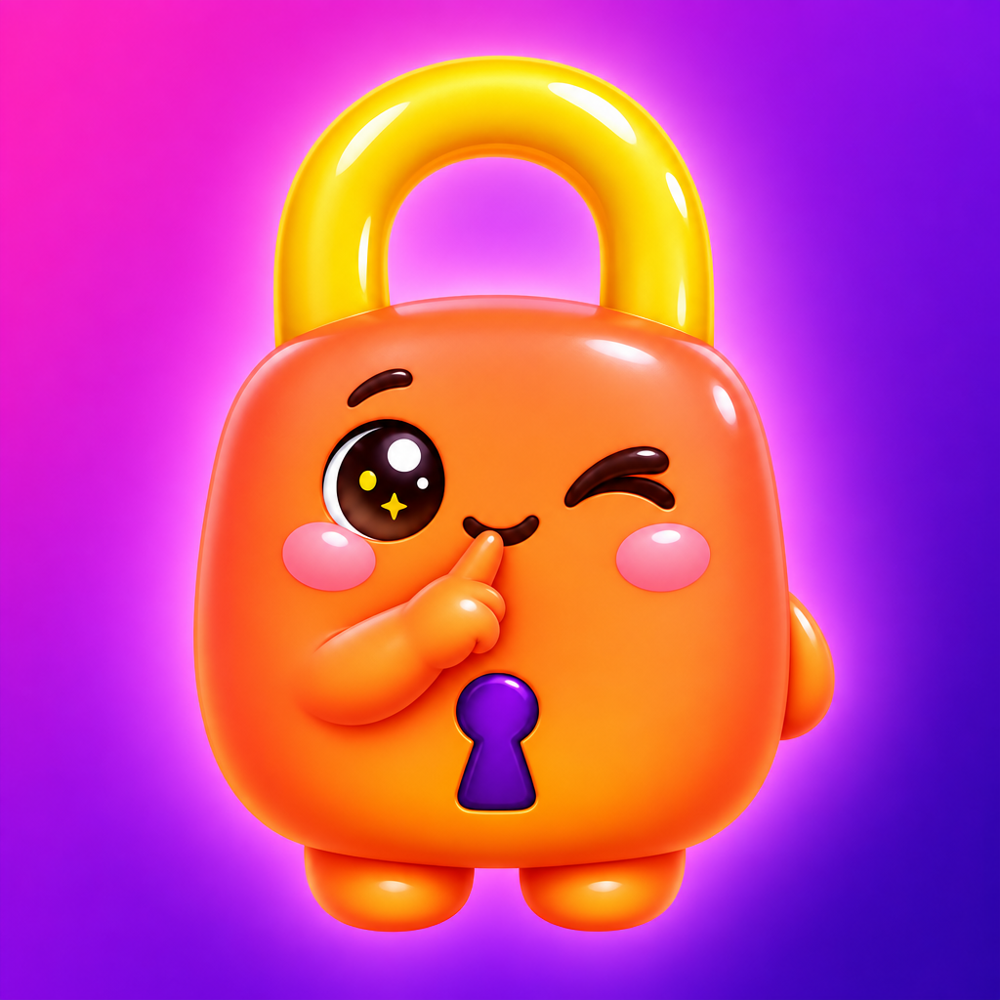

# Shhlock



Your passwords live on a small Bluetooth key you carry. Your Mac fills them into any browser or app
while the key is near — no browser extension, no phone in hand, no cloud.

```
  Shhlock app (iPhone)  ──►  Shhlock Key (XIAO ESP32C3)  ◄──  Shhlock for Mac (menu bar)
  manages the vault,           holds the encrypted vault,        fills logins in Safari, Chrome,
  approves computers           answers paired devices             Firefox, Arc, native apps …
            └────────── every message sealed end-to-end: P-256 + AES-256-GCM ──────────┘
```

| Folder | What it is |
| --- | --- |
| `firmware/` | Arduino firmware for the Seeed Studio XIAO ESP32C3 — the vault, the crypto, the pairing logic |
| `core/` | Swift package: protocol + crypto (`SafelyCore`), **Shhlock for Mac** (`ShhlockMac`), the USB protocol test (`shhlock-keytest`), the Chrome native host |
| `ios/` | SwiftUI app + Password AutoFill extension (`Safely.xcodeproj`) |
| `extension/` | Chrome extension — optional now; kept as an alternative to the Mac app |
| `scripts/` | Installers, tests, TestFlight build, PDF guide |
| `docs/` | `PROTOCOL.md` and the illustrated guide `Shhlock-Guide.pdf` |
| `design/` | Icon and illustration sources |

> Code identifiers, folder names, the bundle ID `com.codecrackjd.safely` and the native-host ID still say
> *safely* on purpose (the project's original code name). Only what people see says Shhlock.

## How it works

1. **The key holds the vault.** Logins are stored on the ESP32 as one AES-256-GCM file. The vault key is never in
   flash in the clear: it is wrapped per paired device with a secret only that device holds. A stolen key alone is unreadable.
2. **The phone manages it.** Pair once by pressing the key's button, load your logins (CSV import from Chrome/Safari,
   or add by hand), approve each computer with a 6-digit code. After that the phone can stay in your pocket, or at home.
3. **The Mac fills.** A menu-bar app watches the focused field through macOS Accessibility, reads the page's address
   from the browser, asks the key for matching logins and fills them. One match fills at once; several show a small
   list under the field to click. Works in every browser and in native apps — nothing to install in the browser.

Why a Mac app and not only Bluetooth? A Bluetooth device can only *type* into a computer (as a keyboard); it cannot
see which site is open or draw a chooser. Something on the computer has to do that. The menu-bar app is that something,
and it is browser-independent — that is what removed the Chrome extension.

## Quick start

**1 · Key** — plug in the XIAO ESP32C3 and flash it (needs `arduino-cli` with the esp32 core, NimBLE-Arduino and ArduinoJson):

```bash
firmware/flash.sh
```

**2 · Phone** — install from TestFlight (or open `ios/Safely.xcodeproj` and Run). In the app: **Key → Pair this phone
with the key → press the button on the key.** Then **Settings → Import from Chrome or Safari** with the CSV that
`chrome://password-manager/settings → Export passwords` gives you (AirDrop it to the phone). The vault syncs to the key.

**3 · Mac**

```bash
scripts/install-mac-app.sh
```

Allow Bluetooth, then from the padlock menu choose **Set up Shhlock…** → allow Accessibility → **Pair with my key**.
Your phone shows the same 6-digit code; approve it there and click **Same code** on the Mac.

**4 · Try it** — open any login page. The fields fill; with several logins, pick one from the list. `⌘⇧F` fills the focused field on demand.

### Chrome extension (optional)

`extension/` still works, now talking to the key directly like the Mac app does. `scripts/install-host.sh`, then Load unpacked. Not needed when the Mac app runs.

## Tests

```bash
cd core && swift test                       # framing, crypto, domain matching, CSV, merge
firmware/flash.sh --test && cd core && swift run shhlock-keytest
                                            # the real key over USB: pairing, approval, sync, save, replay, reboot — 21 checks
```

## TestFlight

```bash
scripts/testflight.sh --upload   # archive + upload with the Apple ID signed in to Xcode
```

## Security model

- **Key:** vault sealed with AES-256-GCM; vault key wrapped per device (HKDF of a 32-byte device secret); P-256 identity in NVS.
  Pairing a phone needs the physical button. Pairing a computer needs the phone's approval of a commitment-bound 6-digit code.
- **Transport:** every message sealed under a static-static ECDH session key, replay-protected by a strictly increasing counter,
  40 requests/min per device. The key answers only devices it knows.
- **Phone:** vault also kept locally (AES-256, Keychain-held key, this device only), Face ID lock, so you can reload a lost or reset key.
- **Mac:** pairing (session key + wrapping secret) in the login keychain. Passwords exist in the Mac's memory only while filling.
- Known limits: no forward secrecy; no BLE bonding (radio-level eavesdroppers see only ciphertext); ESP32 flash encryption not enabled
  (a determined attacker with the key **and** a paired computer's keychain could read the vault); no cloud backup by design — use
  **Settings → Export a backup**.
